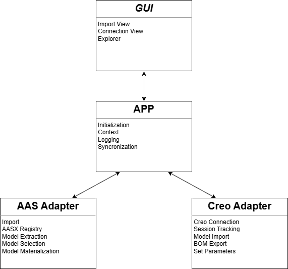

# Code Structure and Interactions

This document provides a detailed overview of the directory structure and the internal modules of the AAS-Creo-Bridge.
It explains how the different parts of the code interact to provide the core functionalities.

## Directory Layout

```text
AAS-Creo-Bridge/
├── docs/                  # Documentation (Sphinx, Architecture, Guides)
├── src/                   # Main source code directory
│   ├── aas_adapter/       # Module for interacting with AAS
│   └── aas_creo_bridge/   # Application core, GUI, and CAD (Creo) adapters
├── tests/                 # Unit and Integration test suite (pytest)
├── creoson/               # Creoson microserver binaries and configuration
├── scripts/               # Build and utility scripts
└── root level files       # configurations (pytest.ini, etc.)
```

## Module Responsibilities

The application uses an adapter pattern to separate presentation, application state, CAD interaction, and AAS
manipulation.

### 1. Main Application Controller (`src/aas_creo_bridge/app/`)

- Acts as the central orchestrator and state manager.
- Manages configurations, user preferences, and the logging infrastructure.
- Serves as the middle layer connecting user actions from the GUI to the backend adapters.

### 2. User Interface (`src/aas_creo_bridge/gui/`)

- A desktop interface built using Tkinter.
- Captures user input (e.g., connecting to Creo, opening an AAS file, triggering an export or import).
- Translates UI events into application commands sent to the Application Controller.
- Receives data back to render trees, tables, and property views.

### 3. CAD Adapter (`src/aas_creo_bridge/creo_adapter/`)

- Interfaces strictly with PTC Creo Parametric.
- Communicates via `creopyson` with to the local `creoson` server.
- Performs all CAD-specific operations:
    - Extracting Assembly Trees & Bill of Materials (BOM).
    - Injecting/Reading part parameters.
    - Sending open/load commands for downloaded CAD models.
- Returns CAD-agnostic Python dictionaries and lists.

### 4. AAS Adapter (`src/aas_adapter/`)

- Built heavily on the Eclipse BaSyx (`basyx.aas`) library.
- Performs all AAS-specific operations:
    - Reading, parsing, and writing `.aasx` bundles.
    - Generating standard Submodels (e.g., Hierarchical structures, Digital Nameplate).
    - Extracting physical payload files (like `.prt` or `.asm` files) contained within the AAS structure.

## Interaction Flow

The interaction between modules typically follows a centralized orchestration pattern managed by the Main Application
Controller.

1. **Trigger**: A process is initiated (e.g., via a GUI event) which invokes the corresponding
   action in the Application Controller.
2. **Orchestration**: The Application Controller determines the necessary sequence of operations and coordinates the
   flow of data between the internal adapters.
3. **Data Extraction/Interaction**: The Controller communicates with the source adapter (e.g., the CAD Adapter to read
   assembly data, or the AAS Adapter to parse an archive). The adapter interacts with its specific domain and returns
   normalized, domain-agnostic Python data structures.
4. **Data Transformation**: The Controller hands the extracted data over to the target adapter.
5. **Generation/Execution**: The target adapter processes the normalized data, converting it into its domain-specific
   format (e.g. applying parameters back to a CAD model).
6. **Feedback and Logging**: Throughout the workflow, the adapters report status, progress, and errors back to the
   Controller. The Controller logs these events and triggers any registered callbacks to update presenting interfaces.



The AAS Adapter and Creo Adapter never directly interact with another. Instead, the Application together with the GUI
handle all communication and data flow.

## Design Patterns: Function Calls vs. Listeners

The application relies on two primary communication patterns between its modules: **Direct Function Calls** and **Event
Listeners (Callbacks)**.

### Direct Function Calls

- **Usage**: Used for synchronous operations where the caller depends on the immediate return of data or status.
- **Context**: Communication between the Main Application Controller and the backend adapters (AAS Adapter and Creo
  Adapter) predominantly uses direct function calls. This ensures operations like parsing data, modifying data
  structures, or making fast local API calls (like to the local Creoson server) occur in a predictable and sequential
  manner.
- **Example**: `creo_adapter.get_assembly_tree()` directly returns the extracted BOM structure.

### Listeners / Callbacks

- **Usage**: Used for asynchronous status updates and decoupling the GUI from the backend application logic.
- **Context**: The GUI often registers listener functions with the Main Application Controller. When long-running tasks
  occur or to handle events, the backend invokes these listeners to notify the user interface that new data is ready to
  be rendered.
- **Example**: The GUI registers an `_on_creo_session_changed` callback. This callback is triggered whenever the Creo
  session changes, allowing the GUI to update its state and display accordingly.
