# User Interface Guide

The application interface is divided into functional views accessible via a side navigation pane.

## Navigation

The navigation pane allows switching between the different workflows:

- **Import View**: Allows opening locally stored AASX files.
- **Explorer View**: Enables inspection of the AAS structures, submodels, and properties.
- **Connection View**: Handles the connection to the CAD system and controls the extraction.

## Using the Import View

To import an existing Asset Administration Shell into the application, follow these steps:

1. **Navigate to the Import View**: Look at the side navigation pane on the left side of the application window. Click
   on the plus icon to open the **Import** tab.

   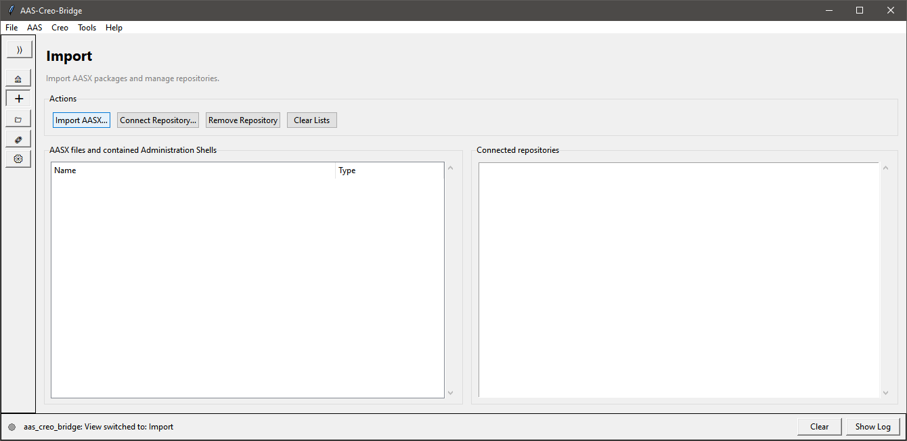

2. **Open the File Dialog**: Once in the Import View, locate the "Actions" section and click the **Import AASX...**
   button.

3. **Select your AASX File**: A standard file dialog will open. Browse your local file system, select the desired
   `.aasx` package, and click **Open**.

   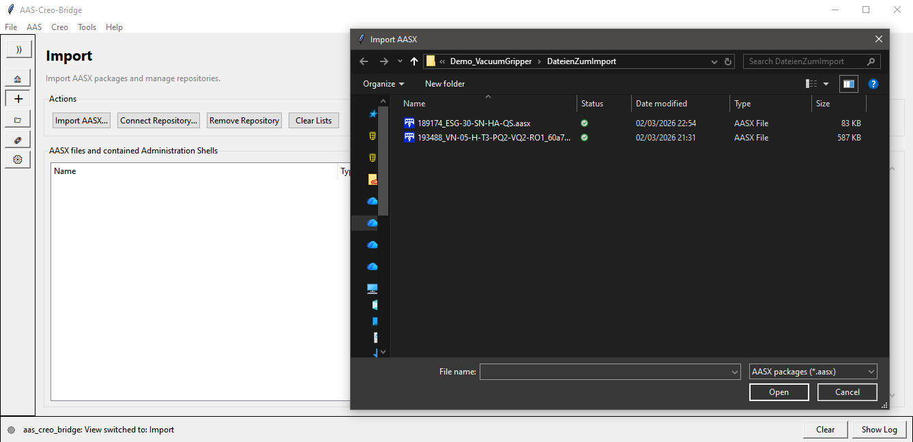

4. **Verify the Import**: The imported Asset Administration Shells will now populate in the tree view on the left pane.
   You can expand the root node to inspect the individual shells contained within the package.

   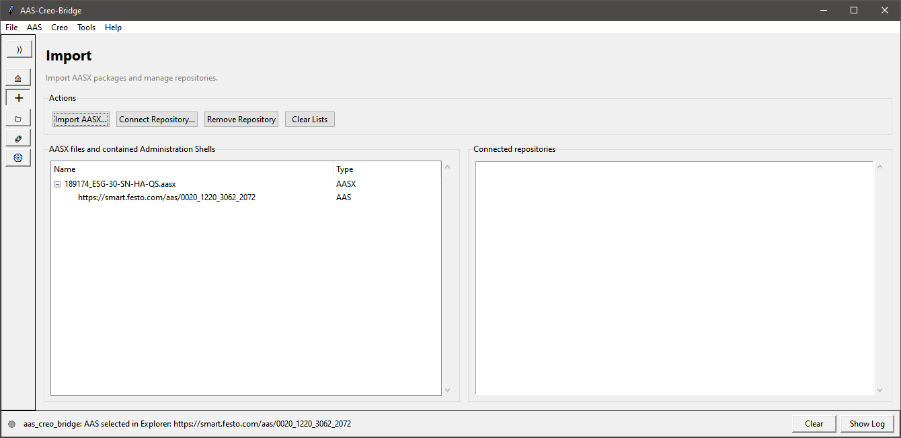

Connecting to a repository is not supported yet.

## Using the Connection View

The Connection View is where you synchronize the active Creo session with your imported Asset Administration Shells.

1. **Navigate to the Connection View**: Look at the side navigation pane on the left side of the application window.
   Click on the chain link icon to open **Connection** tab.

   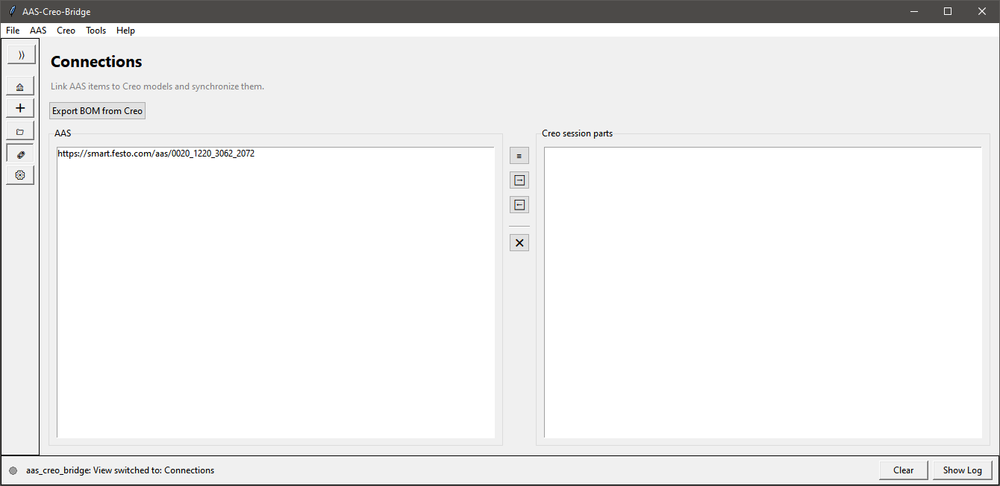

2. **Establish Connection to Creo**: Ensure PTC Creo is running with the correct model open (or an empty session if you
   are importing). The bridge will automatically attempt to connect to the Creoson background service.

3. **Select the Target AAS**: In the Connection View, select the Asset Administration Shell you want to link or import
   from the provided list or dropdown.

   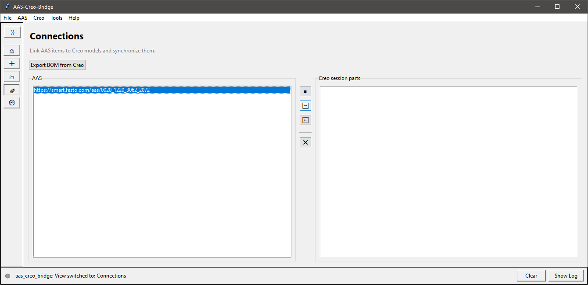

4. **Synchronize / Import**: Click the button with the error to the right to initiate the data transfer. This will align
   the CAD model structure with the loaded AAS instance, or import the model files into the CAD environment.

   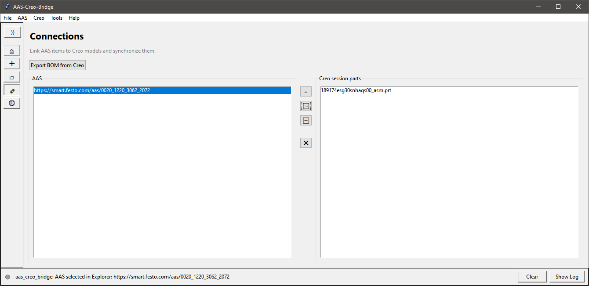

5. **Expected Changes in Creo Parametric**: After the sync completes, switch back to your Creo Parametric window. If you
   imported a model, new parts or assemblies should now be open. The parameters (e.g., `AAS_ID`) within your models
   should be set accordingly.

   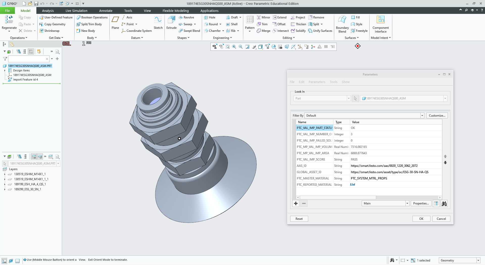

## Exporting a Bill of Materials (BOM)

To extract a Bill of Materials from an open Creo assembly, follow these steps:

1. **Prepare Creo Parametric**: Ensure that your assembly is open and active in your PTC Creo session.

2. **Navigate to the Connection View**: Go to the **Connection** tab in the side navigation pane and verify that the
   Bridge is successfully connected to Creo.

3. **Start Export/Sync**: Click the **Export BOM** (or equivalent Sync) button. The Bridge will read the hierarchical
   structure and part information from the active Creo session.

   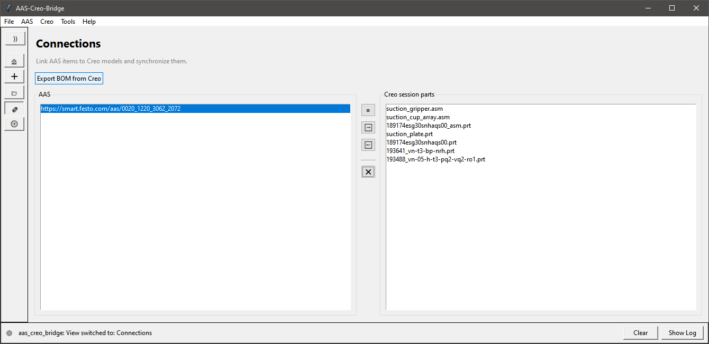

4. **Save the BOM**: A file dialog will open to set a location for saving the extracted BOM. The BOM can only be saved
   as a `.json` file.

   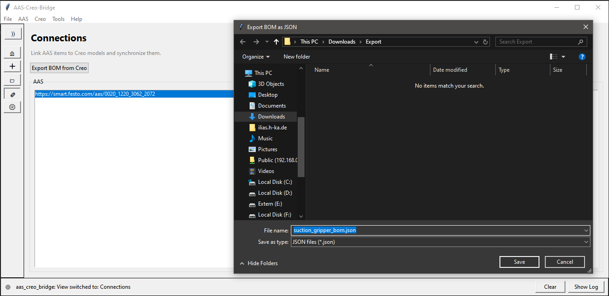

5. **Wait for the export**: Once completed, the extracted BOM will be saved to the specified location. A pop-up message
   will confirm the successful export.

   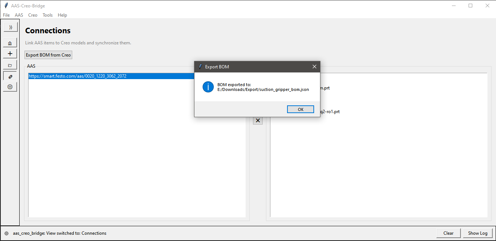

## Using the Explorer View

The Explorer View allows you to inspect the internal structure and properties of your loaded Asset Administration
Shells.

1. **Navigate to the Explorer Tab**: In the side navigation pane, click on the Folder icon to open the **Explorer** tab.

   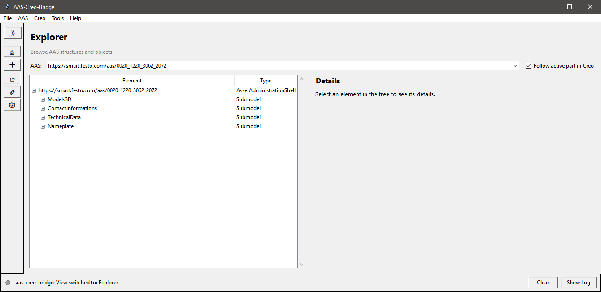

2. **Select the AAS**: At the top you can select the AAS you want to view. If you select "Follow active part in Creo"
   the currently active part from creo will be displayed if an AAS is linked to it. To activate a part open it so it is
   the top part in the model tree.
   The left tree panel displays a hierarchical view of the AAS's contents.
   Expand the Asset Administration Shell to view its Submodels and contained Submodel Elements.

   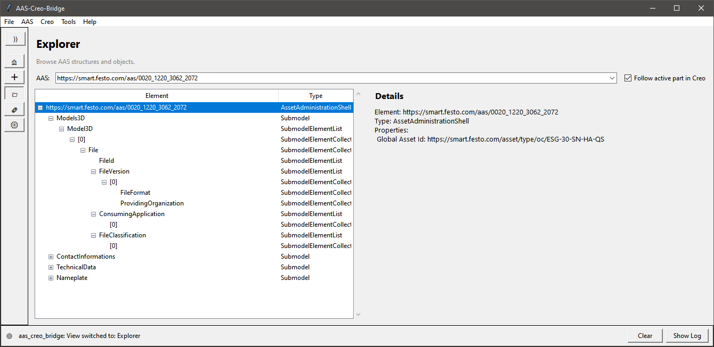

3. **View Element Details**: Select any specific element (e.g., a Property, BOM entry, or Concept Description) in the
   tree. The detail panel will display its attributes, such as values, properties, and category information.

   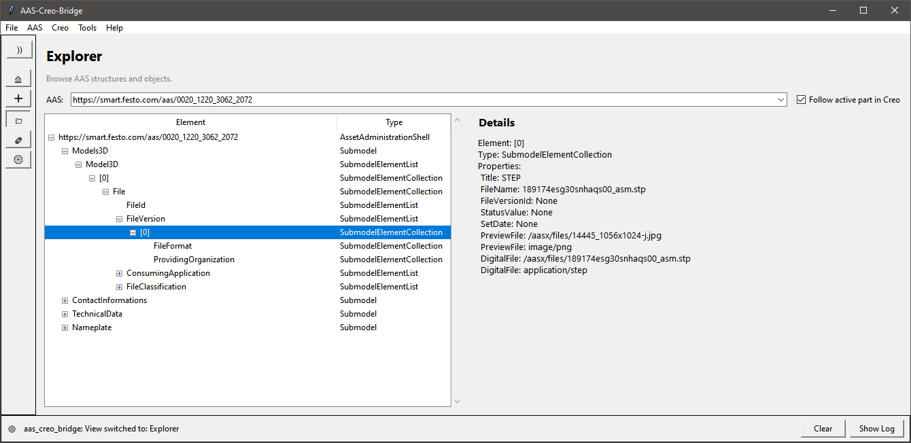
